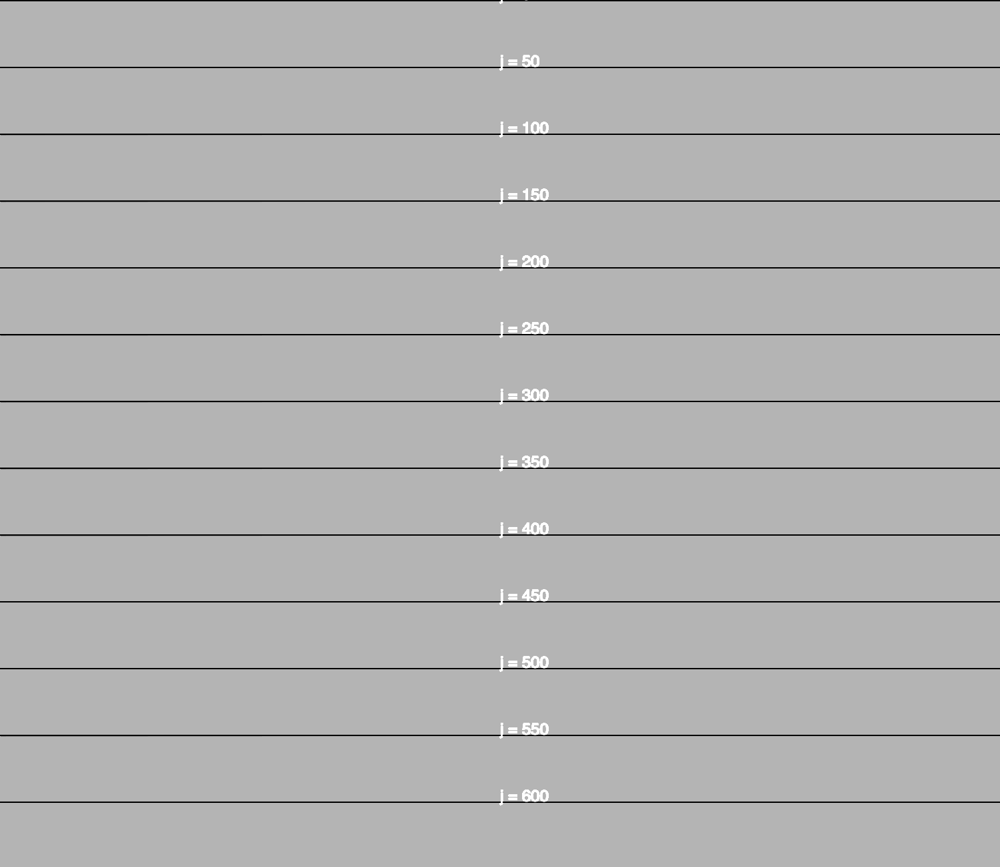
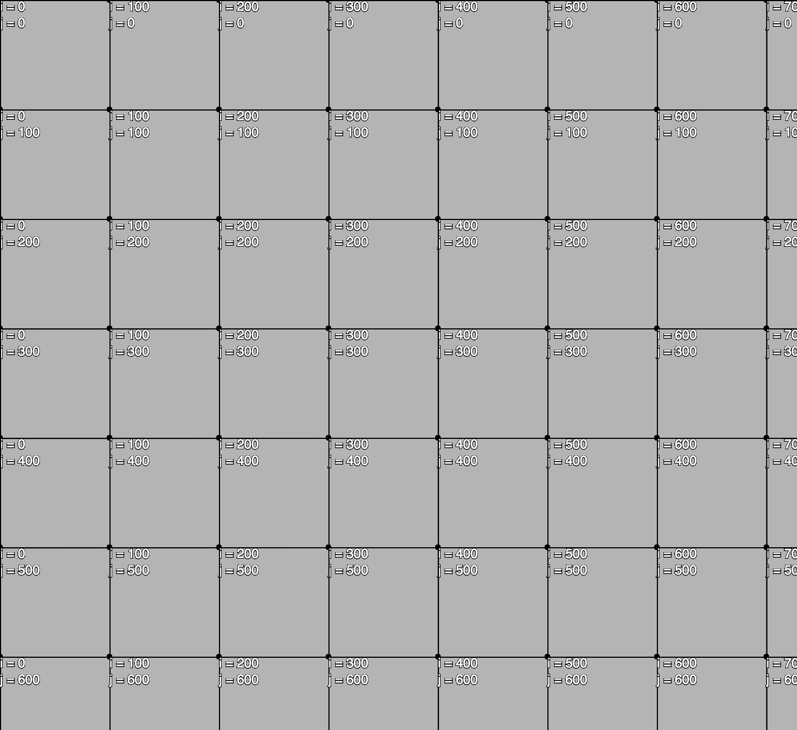
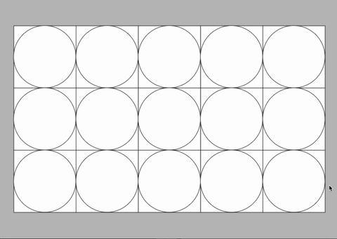
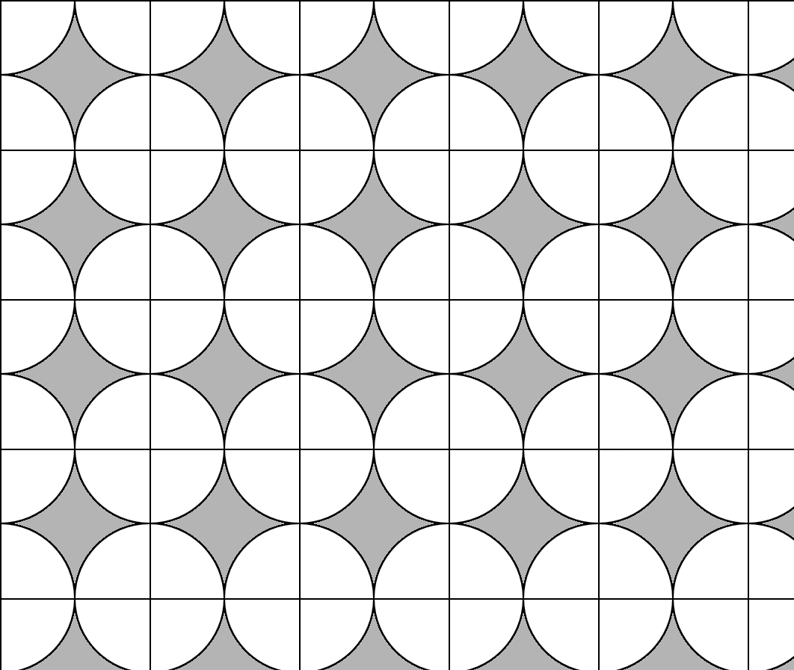

# p5js-designing-interactive-patterns

P5js est un projet issu de processing qui est un langage de programmation basé sur java orienté vers la création graphique et interactive. P5js a pour but de transposer l'esprit de processing au web et donc au langage javascript. C'est un framework simple d'accès pour les débutants avec une bonne documentation et une communauté active. 

P5js propose l'intégration dans un canvas html5 d'un maximum de fonction pour le dessin et d'animation, des possibilités d'interaction à travers différentes interfaces homme machine (clavier, souris, webcam, micro ...), ou encore avec les composants d'une page web et un support partiel mais en développement de webgl.

Vous pouvez consulter [la référence de p5js](https://p5js.org/reference/) qui va décrire avec des exemples l'ensemble des fonction de p5js, mais n'hésitez pas à aussi consulter [les exemples](https://p5js.org/examples/) - qui peuvent par contre s'avérer être un peu plus compliqués à comprendre.

De nombreuses bibliothèques viennent offrir de nouvelles possibilité, mais  p5js peut naturellement s'interfacer avec n'importe quelle bibliothèques js.

Nous allons ici travailler avec [openprocessing.org](https://www.openprocessing.org/), il vous faudra donc créer un compte en ligne et vous pourrez ainsi écrire du code qui sera automatiquement hébergé en ligne et accessible à n'importe qui si vous le souhaitez.

Ce n'est pas la seule façon de procéder, si vous souhaitez plus de détails sur les différentes façon de travailler avec p5js vous pouvez vous référer à [cette portion de cours](https://github.com/b2renger/Introduction_p5js#p5js_tools) 

J'en profite d'ailleurs pour vous donner d'autres liens vers des supports de cours p5js :
- https://github.com/b2renger/Introduction_p5js
- https://github.com/b2renger/p5js_codecreatif

Le premier lien dispose d'ailleurs de rubriques *ressources* et *références* en fin de page qui pointent vers d'autres tutoriels ou bibliothèques et vers des projets artistiques et / ou ludiques impliquant des technos web.

## Les grandes différences entre processing et p5js

### Les différences théoriques

Je vous conseille de commencer par lire les [principes de bases](https://github.com/b2renger/Introduction_p5js#les-principes-de-bases) permettant de comprendre comment s'articule une page web entre fichier html et fichier(s) javascript et qui pose les principes fondamentaux de processing et donc de p5js.

En réalité processing et p5js sont à la fois très similaires et très différents. Dans processing nous écrivons du code **java** et dans p5js nous écrivons du **javascript**. Java et javascript sont des langages fondamentalement différents :

- le java est compilé (quand vous cliquez sur la flèche votre code est "relu" par votre ordinateur et des erreurs vous sont éventuellement présenté, mais il est surtout transformé à ce moment en instructions exécutables = langage machine par votre processeur etc.) Le javascript est un langage interprété : il composé essentiellement de texte et il n'est pas précompilé avant son éxecution.

- le java est executé par une couche logiciel virtuelle, le javascript est éxecuté directement par le(s) navigateur(s).
    
- le java est un langage typé (il existe des types de données : *float*, *int*, *String*, *boolean* etc), le js ne comporte pas de type (tous ces types sont remplacé par un mot clé *let*).

En pratique nous allons nous concentrer sur une sous partie de javascript avec la découverte de  p5js, comme l'on s'intéresse à une sous partie de java lorsque l'on écrit du code processing. 

### En pratique ...

1- Les types : plus de *float* etc. mais des *let*

2- La fonction [size()](https://processing.org/reference/size_.html) permettant de spécifier la taille de notre fenêtre est remplacée par la fonction [createCanvas()](https://p5js.org/reference/#/p5/createCanvas). En effet nous ne créeons plus une fenêtre mais un [**canvas**](https://en.wikipedia.org/wiki/Canvas_element) dans une page web. Le canvas est un élément HTML arrivé avec l'HTML5 permettant d'afficher des images dynamiques via l'éxecution de scripts javascript.

3- Les points virgules à la fin de chaque instruction ne sont plus nécessaires ! mais nous allons quand même les conserver...

4- Le processus de "debugage" lié à la console (la partie dans laquelle s'affichent les messages d'erreurs en rouge) est aussi un peu différent. Afin de pouvoir accéder aux éventuels messages d'erreur, il faut faire un clique-droit sur notre page et cliquer sur "Inspecter", il faut ensuite cliquer sur l'onglet "console".
Pour afficher des messages provenant de notre code dans cette même console, au lieu d'utiliser *println("mon message à afficher")*, nous utiliserons *console.log("mon message à afficher")*

Il existe bien sûr d'autres différences mais elles sont moins impactantes. L'utilisation des fonctions de base de processing que vous connaissez déjà sont les mêmes ou différent de manière minime :

[ellipse()](https://p5js.org/reference/#/p5/ellipse), [line()](https://p5js.org/reference/#/p5/line), [rect()](https://p5js.org/reference/#/p5/rect), [background()](https://p5js.org/reference/#/p5/background), [colorMode()](https://p5js.org/reference/#/p5/colorMode), [fill()](https://p5js.org/reference/#/p5/fill), [stroke()](https://p5js.org/reference/#/p5/stroke) etc.

Nous allons donc maintenant nous intéresser plus directement au code et à la mise en place de nos premiers programmes. Nous devons cependant garder en tête que nos programmes sont exécutés dans un navigateur et que l'utilisateur peut changer la taille de sa fenêtre à tout moment et il ne faut pas que graphiquement cela change trop la donne : nous allons donc devoir travailler de manière **responsive** et donc d'exprimer les coordonnées de nos formes géométrique en fonction de la taille de notre canvas.

## Une page web "responsive" - Dessiner un cercle qui reste au milieu de notre page web

Tout est dit dans le titre !

La première étape comme précisé précédement consiste à créer un **canvas** qui prendra toute la taille disponnible dans notre page web. Au lieu d'utiliser la fonction *size()* de processing nous allons utiliser la fonction [**createCanvas()**](https://p5js.org/reference/#/p5/createCanvas).
Pour que ce canvas prenne toute la taille de notre fenêtre de navigateur nous allons lui passer deux variables [**windowWidth**](https://p5js.org/reference/#/p5/windowWidth) et [**windowHeight**](https://p5js.org/reference/#/p5/windowHeight). Comme précisé dans la documentation ces variables sont des variables système, c'est à dire qu'elles existent et sont accessibles partout dans notre code javascript et n'ont pas besoin d'être déclarées.

```javascript
function setup() {
  createCanvas(windowWidth, windowHeight); 
  // createCanvas(800, 600);
  background(180);
}
function draw(){
  background(180);
}
```

En tapant ou en réalisant un copié/collé de ce petit bout de code, lorsque vous cliquerez sur le bouton *play* vous verrez apparaitre une magnifique page grise prenant toute la surface de votre fenêtre.

Remarquez que si vous redimensionnez votre fenêtre des barres de "scroll" apparaitront à droite en bas pour vous déplacer dans votre page. Cela signifie que votre canvas et plus grand que la page web dans laquelle il s'affiche. En effet le canvas est crée dans le setup() et donc une seule fois au moment où la page est affichée ou actualisée et il garde sa taille initiale.

Vous pouvez essayer de commenter la ligne *createCanvas(windowWidth, windowHeight);* en mettant "//" devant pour la desactiver (les lignes de code précédées par deux slash ne sont pas executées par notre navigateur) et dé-commenter la ligne ci-dessous (en enlevant les deux slashs la précédant). Vous verrez alors un carré gris plus petit que la fenêtre de notre navigateur qui ne changera pas de taille non plus quand la page est redimensionnée.

Il faut donc que nous soyons capables de redimensionner notre canvas à la taille de notre fenêtre lorsque l'utilisateur change la taille de celle-ci. La fonction [**windowResize()**](https://p5js.org/reference/#/p5/windowResized) est justement faite pour cela ! Elle permet d'éxecuter le code situé entre ses accolades '{}' lorsque l'utilisateur redimensionne la fenêtre de son navigateur.
Il ne nous reste alors plus qu'à appeler la fonction [**resizeCanvas**](https://p5js.org/reference/#/p5/resizeCanvas) pour redimensionner notre canvas à la nouvelle taille de notre fenêtre en faisant de nouveau appel aux variables **windowWidth** et **windowHeight** qui ont changé de valeur à la suite de l'action de notre utilisateur.

```javascript
function setup() {
  createCanvas(windowWidth, windowHeight); 
  // createCanvas(800, 600);
  background(180);
}
function draw(){
    
}

function windowResized() {
  resizeCanvas(windowWidth, windowHeight);
}
```

Du coup cette fois c'est bon ! notre canvas reste à la taille de notre fenêtre de navigateur.
Nous allons maintenant fait en sorte de dessiner un cercle au milieu de notre canvas et essayer de faire en sorte qu'il reste au milieu.

Pour rappel le système de coordonnées de processing place l'origine de notre repère dans le coin supérieur gauche de notre canvas :

https://www.openprocessing.org/sketch/388459

Si nous voulons dessiner un cercle au milieu de notre fenêtre et qu'il reste au milieu il faut donc exprimer ses coordonnées en fonction de [**width**](https://p5js.org/reference/#/p5/width) et [**height**](https://p5js.org/reference/#/p5/height) qui sont la largeur et la hauteur de notre zone de dessin.

En ajoutant un appel à la fonction [**ellipse()**](https://p5js.org/reference/#/p5/ellipse) dans le draw(), nous pouvons faire en sorte que notre cercle reste au milieu de notre fenêtre quelle que soit sa taille :

``` javascript
fill(255);
ellipse(width*0.5, height*0.5, 50, 50);
```

Si nous voulons que nos dessins / motifs soient responsifs et gardent un aspect similaire quelque soit la taille de notre fenêtre nous devons réussir à exprimer toutes les coordonnées de nos formes à l'aide de pourcentages (c'est à dire en multipliant ou *width* ou *height* par une valeur comprise entre 0 et 1)

## Dessiner une grille - vive les boucles for !

### Première grille

Nous allons utiliser des boucles [**for()**](https://processing.org/reference/for.html). Le boucles for sont très pratiques pour automatiser une action qui va devoir se répéter plusieurs fois.

La syntaxe générique d'une boucle for ressemble à ceci :

```javascript
for ( /* écrire les conditions qui régissent l'execution*/){
    // écrire le code à exécuter si les conditions sont respectées
}
```

Les **conditions d'éxecution** se précisent en trois étapes séparées par des points virgules, ces étapes doivent être spécifiées entre les paranthèses suivant le mot clé **for** :
- déclarer et initialiser une variable
- faire un test sur cette variable pour savoir si on doit executer le code entre accolade.
- manipuler la variable pour la prochaine execution.

Par exemple, si vous écrivez ceci dans le setup :

```javascript
for (let i = 0 ; i < 10 ; i = i+1){
    println(i);
}
```
Vous répeterez l'action "println(i)" dix fois; cela aura pour effet d'imprimer la valeur de la variable i dans la console tant que celle-ci est inférieur à 10.

Voici ce que l'ordinateur va comprendre :

1 - Première itération
    - i vaut 0 
    - 0 est inférieur à 10 
    - j'imprime i (çàd 0) dans la console
    - j'ajoute 1 à i
    
2 - Deuxième itération
    - i vaut 1 (dernière étape de l'itération précédente)
    - 1 est inférieur à 10
    - j'imprime i (çàd 1) dans la console
    - j'ajouter 1 à i (qui vaudra donc 2)
    
(..)

11 - Onzième itération
    - i vaut 10
    - 10 n'est plus inférieur à 10
    - je sors de la boucle et j'execute la prochaine ligne de code situé après l'accolade fermante.
    
En manipulant les condition d'initialisation, de fin et d'incrémentation de la boucle nous aurons la possibilité de créer bon nombre d'effets visuels. Commençons par essayer de dessiner des lignes verticales balayant l'écrant tous les 50 pixels.

Dans le draw() vous pouvez taper cette boucle :

```javascript
for (let i = 0 ; i < width ; i += 50){
    line(i,0,i,height);
}
```

Vous obtiendrez ce genre de chose :


Vous devriez pouvoir écrire assez facilement une boucle qui vous permettrait d'obtenir une série de lignes horizontales aussi espacées de 50 pixels :



Puis finalement une grille d'espacement 100 en combinant deux boucles for, l'une dans l'autre.



Remarquez ici que les coordonnées (i,j) qui sont calculées par l'imbrication de nos deux boucles nous donnent le point supérieur gauche de chaque case.

```javascript
for (let i = 0; i <= width; i += 100) {
    for (let j = 0; j <= height; j+= 100) {
        line(i,0,i,height);
        line(0,j,width,j);
    }
}
```

### Une grille de cercles 

Nous allons maintenant essayer de dessiner une grille de cercles :



```javascript
for (let i = 0; i <= width; i += 100) {
    for (let j = 0; j <= height; j+= 100) {
        ellipse(i,j,100,100);
        line(i,0,i,height);
        line(0,j,width,j);
    }
}
```
La fonction ellipse() prenant comme paramètres les coordonnées centre du cercle, notre cercle est dessiné autour de chaque intersection.



Dans cet exemple nos cercles font une taille fixe de 100 pixels. Nous allons maintenant faire en sorte que ces cercles changent de taille à chaque fois que nous cliquons sur la souris.

#### un peu d'interaction : des grilles à différentes granularités

Tout d'abord il va nous falloir créer une variable qui sera la taille de chaque case et qui correspondra donc à la valeur dont nous augmentons chaque variable de la boucle for. Cette variable pourra par exemple s'appeler "slotSize" et nous l'initialiserons avec une valeur de 100.

Avant le setup() (et ceci pour que notre variable soit disponible dans tout notre programme), nous pouvons donc écrire cette ligne qui sert à déclarer et initialiser une variable.

```javascript
let slotSize = 100;
```
Nous allons maintenant utiliser notre variable dans notre boucle for (qui se trouve dans le draw()) pour ajuster la taille de nos cases et de notre ellipse à la valeur contenue dans la variable slotSize (ici 100 pour l'instant mais nous allons pouvoir la changer ultérieurement) - il suffit de remplacer "100" par "slotSize" dans nos deux boucles for imbriquées :

```javascript
for (let i = 0; i <= width; i += slotSize) {
    for (let j = 0; j <= height; j+= slotSize) {
        ellipse(i,j,slotSize,slotSize);
        line(i,0,i,height);
        line(0,j,width,j);
    }
}
```
Il ne nous reste plus qu'à manipuler notre variable slotSize et lui donner de nouvelles valeurs : nous allons faire en sorte que cette valeur change pour une valeur aléatoire chaque fois que nous appuyons sur la souris. Pour cela il suffit d'utiliser la fonction [**mousePressed()**](https://p5js.org/reference/#/p5/mousePressed) : à chaque fois que nous appuyons sur la souris le code entre les accolades sera exécuté. Nous voulons alors utiliser [**random()**](https://p5js.org/reference/#/p5/random) pour attribuer à notre variable "slotSize" une nouvelle valeur aléatoire entre une valeur minimale et une valeur maximale.

```
function mousePressed() {
    slotSize = random(10, 200);
}
```
Notez bien que mousePressed() est une nouvelle fonction qui doit donc se situer en dehors du setup() et du draw().

#### des cercles centrés dans nos cases

Nous allons maintenant faire en sorte que nos cercles soient centrés dans nos cases. Nous allons donc manipuler les condition de démarrage et d'arrêt de nos boucles pour que "i" et "j" nous donnent le centre des cases plutôt que le coin supérieur gauche.


Nos cases sont carrées et de taille "slotSize", il nous suffit donc d'ajouter la moitié de slotSize à i et à j pour obtenir le centre de chaque case.

```javascript
fill(255);
for (let i = 0; i <= width ; i += slotSize) {
    for (let j = 0; j <= height ; j += slotSize) {
        line(i, 0, i, height);
        line(0, j, width, j);
    }
}

for (let i = slotSize / 2; i <= width - slotSize / 2; i += slotSize) {
    for (let j = slotSize / 2; j <= height - slotSize / 2; j += slotSize) {
        ellipse(i, j, slotSize, slotSize);  
    }
}
```

Remarquez que lorsque vous redimensionnez votre fenêtre, certains cercles apparaissent ou disparaissent en bordure et que notre grille n'est pas centrée. Nous allons essayer de remédier à cela.

#### un grille centrée dans notre page

Il y a plusieures options ici : 

- soit nous connaissons le nombre de case que nous voulons afficher en largeur et hauteur et nous calculons la taille de nos incréments (la partie 'i = i+100') pour que le bon nombre de cases soit créé.

- soit nous connaissons la taille des cases que nous voulons afficher et nous calculons le nombre de cases en fonction de la taille de la fenêtre.

Vu ce que nous avons réalisé jusqu'à maintenant, nous allons opter pour la seconde option. D'ailleurs la description de ce que nous devons réaliser n'est pas tout à fait exacte. Il n'est pas garanti que le nombre aléatoire sur lequel nous tomberons en cliquant sur la souris soit un multiple de la taille de notre fenêtre ... surtout que ce nombre est potentiellement un nombre à virgule et que notre utilisateur peut changer la taille de la fenêtre comme bon lui semble ...
c'est donc un peu plus compliqué ...

Il faut que nous calculions le nombre maximum de cases que l'on peut faire tenir dans notre fenêtre en fonction de la taille des cases et de la taille de notre fenêtre.

En fonction du résultat de ce calcul il nous restera un espace vide qui sera inférieur à la taille d'un case. Cet valeur (en pixel) de l'espace restant nous pourrons la diviser par deux pour créer une marge en haut et en bas et une marge à droite et à gauche.

Il faut donc que nous commencions par déclarer des variables globales (tout en haut de notre programme) en dehors de toute accolade

```javascript
let marginX;
let marginY;
```

Ensuite dans le setup(), nous devons calculer la taille de nos marges. Il faut diviser respectivement la largeur et la hauteur de notre fenêtre par la taille de nos cases. Il faut prendre la partie entière de cette division et la multiplier par la taille de chacune de nos cases. Si l'on soustrait ce résultat à chaque dimension de notre fenêtre on obtien en pixel l'espace restant en pixel un fois que l'on a affiché un maximum de case soit deux fois notre marge.

```javascript
marginX = windowWidth - int((windowWidth / slotSize)) * slotSize;
marginY = windowHeight - int((windowHeight / slotSize)) * slotSize;
```
Ce calcul doit être effectué dans le setup() pour que nôtre grille s'affiche correctement au chargement de notre page et il doit être refait à chaque fois que notre page change de taille (càd dans la fonction *windowResized()* après l'appel *resizeCanvas()*) mais aussi quand on change la taille de nos cases (càd dans la fonction *mousePressed()* après l'appel à *random()* pour spécifier une nouvelle taille de case).

Il faut maintenant utiliser ces deux nouvelles variables dans les conditions de départ et d'arrêt de notre boucle for :

```javascript
for (let i = marginX / 2 + slotSize / 2; i < width - marginX / 2; i += slotSize) {
    for (let j = marginY / 2 + slotSize / 2; j < height - marginY / 2; j += slotSize) {
        fill(255)
        rect(i, j, slotSize, slotSize);
        fill(255)
        ellipse(i, j, slotSize, slotSize);        
    }
}
```

Et voilà nous arrivons enfin au résultat du gif affiché précédement. A partir maintenant le code que vous allez écrire ce situera principalement à l'intérieur de ces deux boucles for; il est possible de faire énormément de choses. Le code que nous avons écrit jusqu'à maintenant va être votre base de départ pour pouvoir créer des pavages géométriques tous plus beaux les uns que les autres !

Le code complet de ce premier programme entiérement "responsif" est disponible [ici](https://github.com/b2renger/p5js-designing-interactive-patterns/sketch_01_c_responsive_grid).


## Un peu d'interaction avec la souris


